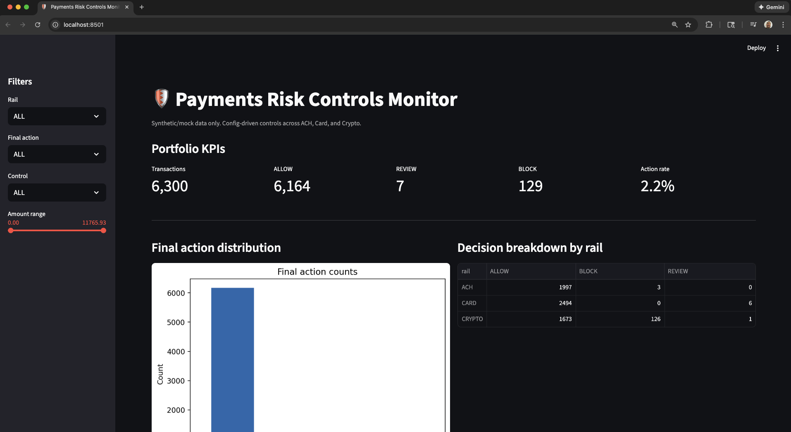
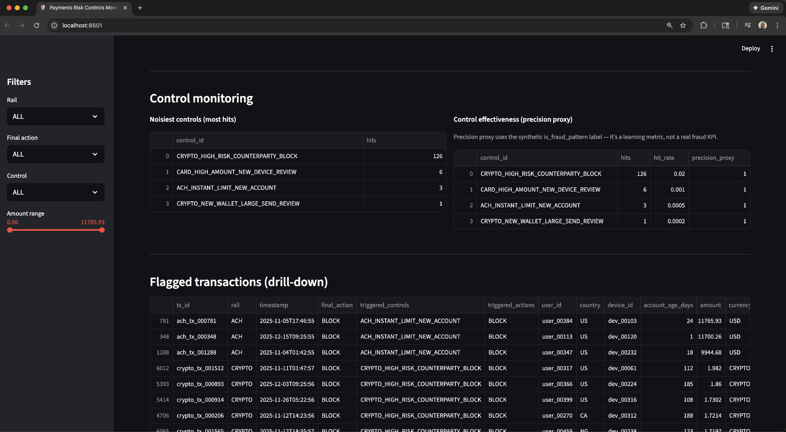
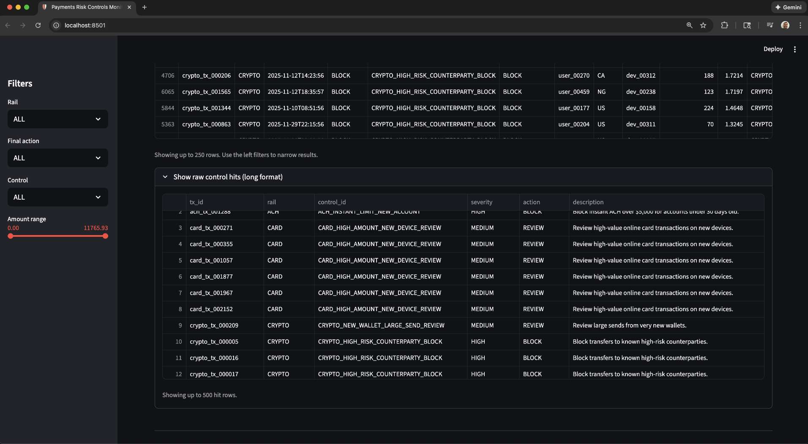

# Payments Risk Controls Simulator

A config-driven payments risk controls system built with synthetic data to simulate how modern fintech teams monitor, tune, and operate transaction-level risk controls across ACH, card, and crypto rails.





<p align="center">
  <em>Streamlit dashboard showing decision volume, control noise, and drill-down analysis across multiple payment rails.</em>
</p>

---

## At a glance

**What this project demonstrates:**

- How payments risk controls are defined, evaluated, and monitored at scale.
- Separation of policy (YAML) from execution (Python engine).
- Realistic ALLOW / REVIEW / BLOCK decisioning patterns.
- Control observability, noise detection, and tuning workflows.
- End-to-end system design from data generation to monitoring.

**Important note:**  
This project uses **synthetic and mock data only**. No real customer or transaction data is involved.

---

## What this project does

This project simulates a simplified but realistic **payments risk controls pipeline** similar to what might exist inside a fintech, bank, or crypto platform.

### 1. Generates multi-rail synthetic transactions

- ACH, card, and crypto transactions in a single dataset.
- Account age, device behavior, wallet age, funding speed, and counterparty risk.
- Intentional injection of edge cases so controls have realistic patterns to catch.

### 2. Evaluates config-driven controls

- Controls are defined in `controls/controls.yaml`.
- Each control specifies:
  - Target rail
  - Threshold-based conditions
  - Final action (ALLOW, REVIEW, BLOCK)
- The engine dynamically evaluates each transaction against all applicable controls.

### 3. Produces monitoring outputs

The controls engine generates:

- **Per-transaction decisions**
- **Control hit logs** (long format)
- **Control-level metrics**, including hit volume and a precision proxy using a synthetic fraud label

These outputs mirror what internal risk tooling would surface for monitoring and tuning.

### 4. Visualizes results in a monitoring dashboard

The Streamlit dashboard provides:

- Portfolio-level KPIs (ALLOW / REVIEW / BLOCK)
- Decision breakdown by rail
- Noisiest controls by hit count
- Control effectiveness proxy
- Drill-down into flagged transactions with reasons
- Filters for rail, action, control, and transaction amount

---

## Tech stack

- **Python** for data generation and controls evaluation.
- **pandas** for transformations and analysis.
- **YAML** for declarative control configuration.
- **Streamlit** for internal-style monitoring dashboards.
- **matplotlib** for lightweight visualization.

---

## Repository structure

```text
payments-risk-controls-simulator/
├─ controls/
│  └─ controls.yaml                 # Config-driven control definitions
│
├─ src/
│  ├─ generate_synthetic_data.py    # Multi-rail synthetic transaction generator
│  ├─ controls_engine.py            # Core controls evaluation engine
│  └─ run_controls.py               # Pipeline runner
│
├─ dashboard/
│  └─ streamlit_app.py              # Controls monitoring dashboard
│
├─ docs/
│  ├─ Payments_Risk_Controls_Report.md
│  └─ img/
│     ├─ controls_dashboard_1.png
│     ├─ controls_dashboard_2.png
│
└─ data/
   └─ *.csv                          # Generated outputs (synthetic)
```

---

## How to review this project without running anything

If you want a quick overview:

1. Review the dashboard screenshots above.
2. Scan the control definitions in `controls/controls.yaml`.
3. Read `docs/Payments_Risk_Controls_Report.md` for analysis and observations.

That provides a complete picture of how the system works and how I think about risk controls.

---

## Run locally (optional)

```bash
git clone https://github.com/cloudquiza/payments-risk-controls-simulator.git
cd payments-risk-controls-simulator

python -m venv .venv
source .venv/bin/activate

pip install -r requirements.txt

python src/generate_synthetic_data.py
python src/run_controls.py
streamlit run dashboard/streamlit_app.py
```

---

## Why I built this

I built this project to better understand how risk controls behave once real volume, noise, and edge cases start showing up.

Working through the system end to end made it easier to reason about where risk signals hold up, where they start to break down, and how teams monitor and tune controls over time.

It also gives me recent, concrete scenarios I can walk through clearly during interviews, without relying on real customer data or only on older examples from past roles.

Feedback and ideas for extensions are always welcome.
